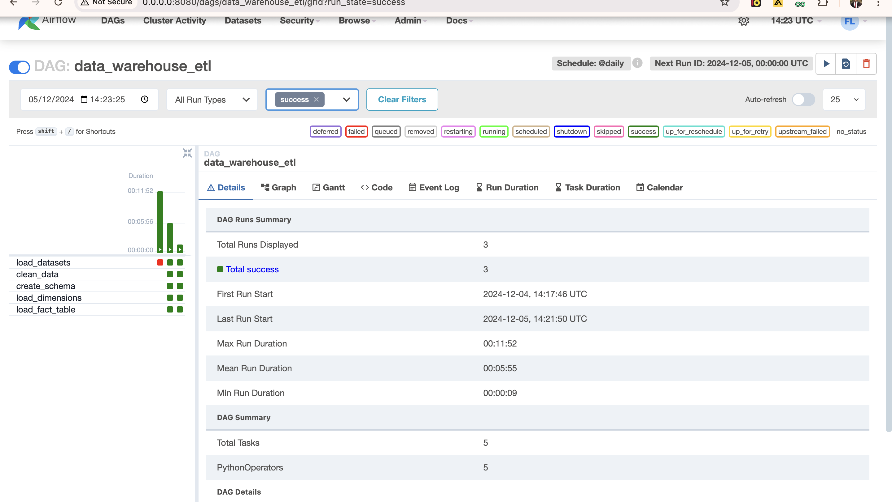
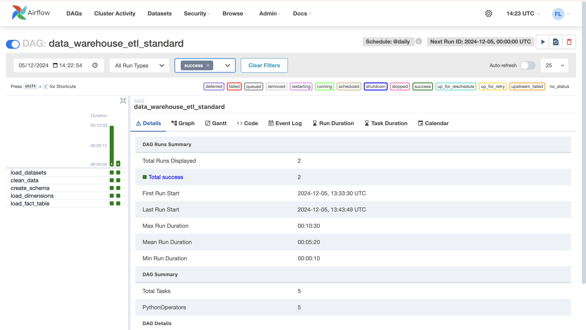

## Assignment 1 Solution


# Data Warehouse ETL Pipeline

## Project Overview
Welcome to the **Data Warehouse ETL Pipeline**! This project implements a robust and scalable ETL (Extract, Transform, Load) pipeline to seamlessly consolidate time-tracking and project data from **ClickUp** and **Float**. We focus on data quality and best practices to ensure the pipeline is efficient, easy to maintain, and deploy.

## DAGs Overview

This repository contains **two DAGs** that perform similar ETL operations, but with different configurations and specifications:

1. **Basic DAG (`dim_process.py`)**: This is the basic version of the ETL pipeline DAG. It demonstrates a simple, functional ETL process for those who are new to Airflow or need a lightweight solution. It's easy to understand and extend for custom use cases.

     <!-- Replace with actual image path -->

2. **Standard DAG (`data_warehouse_etl_dag.py`)**: This is a more **advanced, robust DAG** designed with **best practices** in mind. It includes a structured arrangement, optimized code, and proper software specifications for scalability and maintainability. This DAG follows the industry-standard workflow patterns, ensuring that the ETL process is efficient, reusable, and production-ready.

     <!-- Replace with actual image path -->

## Data Warehouse Design

The data warehouse design for this project follows a **star schema** approach, which includes the following components:

### **Dimensions:**
1. **`dim_project`**: Stores details about projects. Each project is uniquely identified by a `project_key`. The attributes include `client_name` and `project_name`.
    ```sql
    CREATE TABLE IF NOT EXISTS dim_project (
        project_key INTEGER PRIMARY KEY,
        client_name TEXT,
        project_name TEXT
    )
    ```

2. **`dim_employee`**: Contains information about employees. Each employee is identified by an `employee_key`, with attributes such as `name` and `role`.
    ```sql
    CREATE TABLE IF NOT EXISTS dim_employee (
        employee_key INTEGER PRIMARY KEY,
        name TEXT,
        role TEXT
    )
    ```

### **Fact:**
1. **`fact_task_tracking`**: This fact table captures task tracking details, linking the tasks to projects and employees. It records the hours worked on each task, whether it was billable, and the task description.
    ```sql
    CREATE TABLE IF NOT EXISTS fact_task_tracking (
        task_key INTEGER PRIMARY KEY,
        project_key INTEGER,
        employee_key INTEGER,
        date DATE,
        hours REAL,
        billable BOOLEAN,
        task_description TEXT,
        FOREIGN KEY(project_key) REFERENCES dim_project(project_key),
        FOREIGN KEY(employee_key) REFERENCES dim_employee(employee_key)
    )
    ```

### **Design Explanation:**
- **Dimension Tables**: These tables store descriptive information about the entities in our data model (i.e., projects and employees). They allow us to slice and dice the fact data for analysis.
- **Fact Table**: This table stores the quantitative data about tasks performed, capturing metrics like hours worked and whether tasks were billable. It contains foreign keys that link to the dimension tables, enabling us to join them for detailed analysis.

---

## ETL Scripts and Processes

### **ETL Process Overview:**
The ETL process involves extracting data from two sources (**ClickUp** and **Float**), transforming it to match the target schema, and loading it into the data warehouse.

### **ETL Pipeline Breakdown:**
1. **Extract**:
    - Data is extracted from **ClickUp** and **Float** using APIs or flat files. The data includes task information, employee details, and project information.

2. **Transform**:
    - The data is cleaned and transformed using Python and SQL:
      - The `dim_project` and `dim_employee` tables are populated by extracting and transforming relevant data from the source.
      - The `fact_task_tracking` table is populated with task data, ensuring it includes references to the corresponding project and employee.

3. **Load**:
    - The transformed data is loaded into the PostgreSQL data warehouse, ensuring proper data types and relationships between tables.

The ETL process is managed by **Apache Airflow**, where the process is broken down into tasks that execute in a defined sequence.

### **ETL DAGs**:
There are two **Airflow DAGs** for running the ETL process:
1. **Basic DAG (`dim_process.py`)**: A lightweight, simple ETL pipeline for quick testing or smaller-scale projects.
2. **Standard DAG (`data_warehouse_etl_dag.py`)**: A robust ETL pipeline following best practices, with structured code, error handling, logging, and scalability considerations.

---

## Data Integrity and Cleanliness

Ensuring data integrity and cleanliness is essential for maintaining a reliable data warehouse. The following strategies are employed in this project to ensure the quality of the data:

### **1. Missing Data Handling**:
- **Data validation**: We check for missing values in critical fields, such as project and employee identifiers, before inserting data into the fact table.
- **Default values**: For non-essential fields, default values are used if no data is found.

### **2. Data Deduplication**:
- **Duplicate Removal**: During the ETL process, we check for duplicate records (e.g., multiple entries for the same task) and remove them before loading data into the warehouse.
- **Primary Keys**: All tables use primary keys (e.g., `task_key`, `employee_key`, `project_key`) to enforce uniqueness.

### **3. Referential Integrity**:
- **Foreign Key Constraints**: The `fact_task_tracking` table enforces referential integrity by including foreign keys to the `dim_project` and `dim_employee` tables. This ensures that every task entry is linked to an existing project and employee.
    ```sql
    FOREIGN KEY(project_key) REFERENCES dim_project(project_key),
    FOREIGN KEY(employee_key) REFERENCES dim_employee(employee_key)
    ```

### **4. Schema Validation**:
- **Schema Checks**: We validate that the extracted data conforms to the expected schema before processing. If any discrepancies are found (e.g., missing required fields), the data is flagged for review.

### **5. Monitoring and Logging**:
- **Airflow Logging**: Airflow provides detailed logs for each task, which helps track the success or failure of each ETL step.
- **Custom Data Quality Operator**: A custom operator is used to monitor data quality and trigger alerts if any issues are detected during the ETL process.


## Prerequisites
Before you start, make sure you have the following installed:

- **Python 3.8+**
- **Apache Airflow** (with necessary configurations)
- **SQLAlchemy**
- **pandas**

## Installation

To get started, follow these steps:

1. **Clone the repository**:
   ```bash
   git clone https://github.com/OGsiji/Data-Warehousing-with-Airflow.git
   cd Data-Warehousing-with-Airflow
   ```

2. **Create a virtual environment**:
   ```bash
   python3 -m venv airflow_env
   source airflow_env/bin/activate  # On Windows, use airflow_env\Scripts\activate
   ```

3. **Install the required dependencies**:
   ```bash
   pip install -r requirements.txt
   ```

4. **Configure your environment** by setting up the `.env` file:
   - `DB_CONNECTION_STRING` - Your database connection string.
   - `CLICKUP_PATH` - Path to ClickUp data.
   - `FLOAT_PATH` - Path to Float data.
   - `LOG_LEVEL` - Desired log level for monitoring.

## Project Structure

Here’s a breakdown of the updated project directory:

```
project_root/
├── dags/                  # Airflow DAG definitions
│   ├── data_warehouse_etl_dag.py    # Standard DAG (optimized, production-ready)
│   └── dim_process.py              # Basic DAG (simple, lightweight solution)
├── plugins/               # Custom plugins and operators
│   └── operators/
│       └── data_quality_operator.py
├── src/                   # Source code for ETL logic and configuration
│   ├── __init__.py
│   ├── config/            # Configuration management
│   │   ├── __init__.py
│   │   └── config.py
│   ├── data_pipeline/     # ETL logic (Extract, Transform, Load)
│   │   ├── __init__.py
│   │   ├── extract.py
│   │   ├── transform.py
│   │   └── load.py
│   └── models/            # Data models (for structuring the processed data)
│       ├── __init__.py
│       ├── base.py
│       ├── project_models.py
│       └── dimensional_models.py
├── tests/                 # Unit and integration tests for the ETL process
│   ├── __init__.py
│   ├── test_extract.py
│   ├── test_transform.py
│   └── test_load.py
├── data/                  # Raw and processed data
│   ├── raw/
│   └── processed/
├── logs/                  # Airflow logs
├── requirements.txt       # Python dependencies
├── setup.py               # Package setup file
├── README.md              # This README
└── .env                   # Environment variables for the pipeline
```

## Running the Pipeline

Once everything is set up, you can trigger the DAG manually from the command line with:

```bash
airflow dags trigger data_warehouse_etl  # For the Standard DAG
```

Or

```bash
airflow dags trigger dim_process  # For the Basic DAG
```

This will start the ETL process, pulling data from ClickUp and Float, transforming it, and loading it into the data warehouse.

## Testing

To run the tests and ensure everything is functioning as expected:

```bash
cd src

python -m pytest tests/
```

## Data Quality Checks

Data integrity is crucial in any ETL pipeline, and this project includes several built-in **data quality checks**:

- **Missing Value Validation**: Ensure that there are no missing or null values in critical columns.
- **Duplicate Record Detection**: Identify and handle duplicate records during transformation.
- **Schema Validation**: Verify that the incoming data matches the expected schema before processing.

## Logging

Logging is configured to track detailed information about each step in the ETL process. The log level is configurable, and you can change it in the `.env` file to **debug**, **info**, **warning**, **error**, or **critical** based on your monitoring needs.

## Why This Project is Exciting

This pipeline is **scalable**, **robust**, and built with **best practices** in mind. Whether you're new to Airflow or a seasoned pro, you'll find this project useful for learning and applying the core principles of ETL processes in real-world environments.

Additionally, with the **standard DAG**'s optimized arrangement and **industry-standard specifications**, you'll be able to confidently run and manage data pipelines at scale—perfect for handling growing datasets and ensuring data accuracy.

